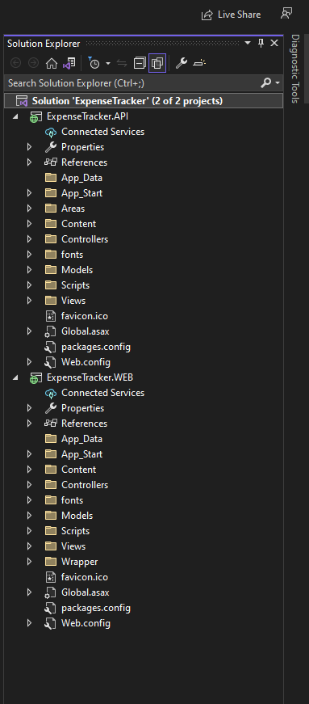

# Welcome to Expense Tracker 

In this Project there is mainly two part
1. Web API
2. Web Client

# Prerequisites

- Visual Studio (2022)
- .NET Framework
- .NET Core 
- NUGet packages
	- Entity framework
	- ASP.NET Core SQL Server
	- ASP.NET MVC
	- ASP.NET Razor
	- ASP.NET WEB API
	- ASP.NET WEB API CORE
	- ASP.NET Web API.CLIENT
## Steps for Running the Projrct
step 1: Open Visiual Studio 2022
step 2: Open ExpenseTracker.sln file in vs 2022
step 3: Load both Web API and web client project files
step 4: Open Solution Explorer In vs 2022 -> right click on Solution 'Expence Tracker' -> open 'Set Startup Project' -> select Multiple Startup Project -> check both Expencetracker.Web & Expencetracker.API and press Apply then press ok.
step 5: On Tab bar start the project
step 6: It will run the both Web API and web client project simultaneously.

## Screenshots

## 
